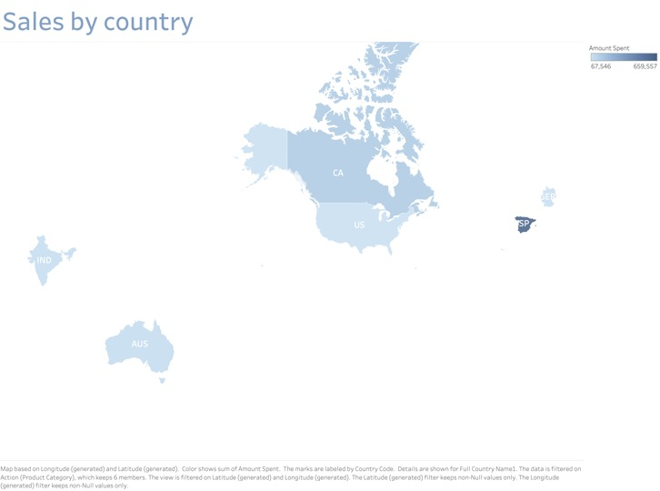
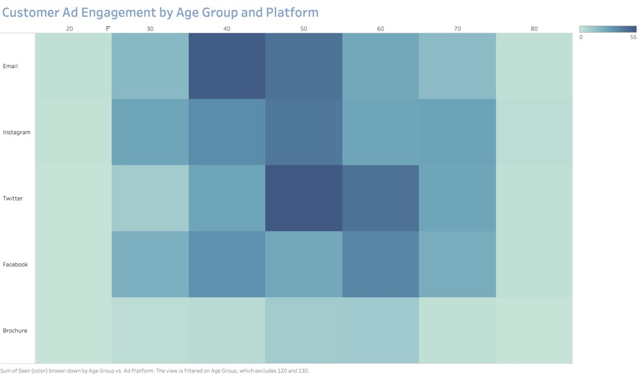
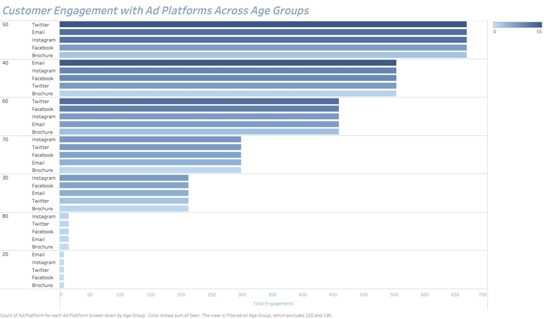
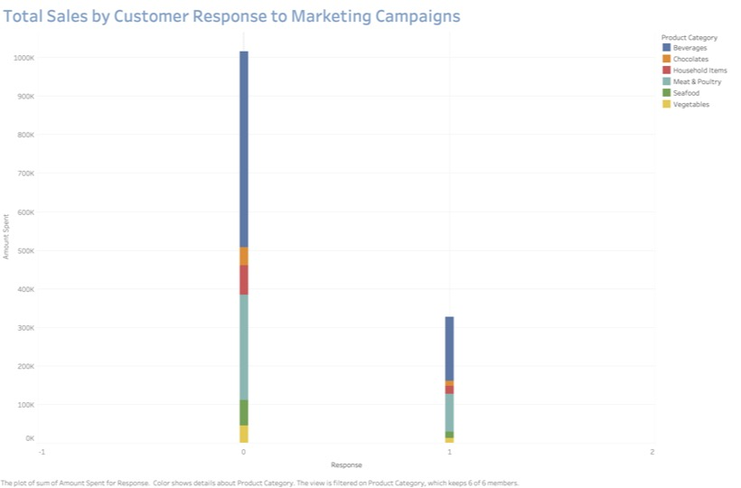
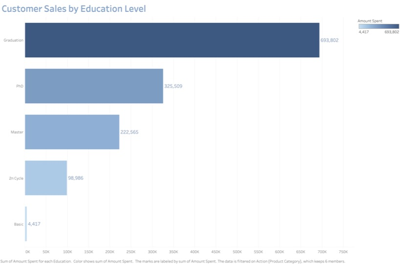
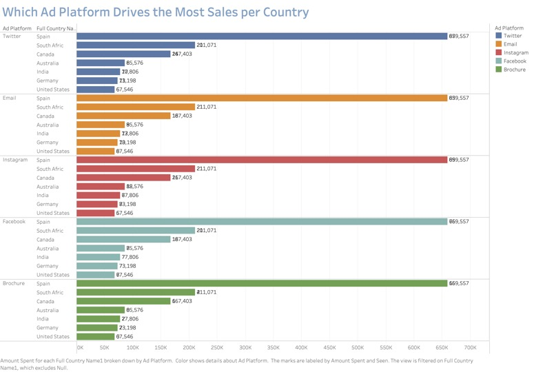
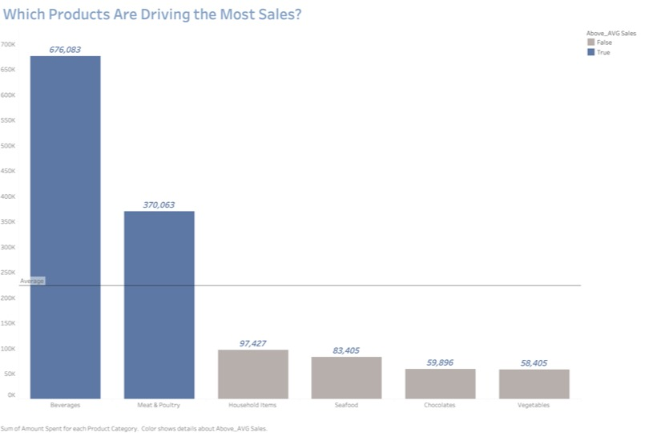
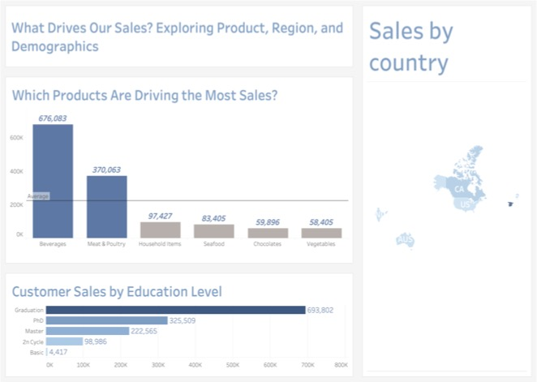
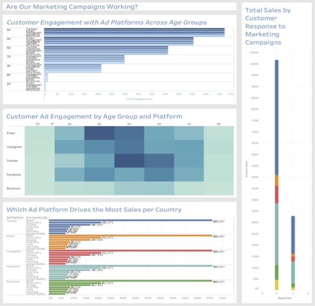

# 2Market Customer Insights Project

This project was completed as part of the Data Analytics Career Accelerator at the London School of Economics (LSE). It simulates a real-world business case for a fictional retail brand, 2Market, and uses data analytics to uncover customer insights and evaluate marketing campaign performance.

---

## 📊 Project Overview

The goal of this project was to explore customer demographics, spending behavior, and campaign results to help guide business strategy and improve decision-making.

The analysis was conducted using:
- **Excel**: For initial exploration, data cleaning, and pivot-based analysis  
- **PostgreSQL**: For querying structured customer and transaction data  
- **Tableau**: For building interactive dashboards that visualize key findings  

---

## 🔍 Key Questions Explored

- What is the profile of the company’s customers?  
- Which countries generate the highest sales?  
- How does customer income relate to product spending?  
- What platforms (email, phone, etc.) are most effective for marketing?  
- What recommendations can improve campaign ROI?

---

## 🧠 Key Insights

- Customers with higher income brackets spent more on targeted products  
- Email and phone campaigns performed better than mobile messaging  
- Country and marital status had notable impact on spending levels  
- Visual dashboards identified top-performing segments and countries

---

## 🛠 Tools Used

- **Excel**: PivotTables, formulas, exploratory analysis  
- **PostgreSQL**: SQL queries for grouped analysis and aggregations  
- **Tableau**: Dashboard creation, filtering, and KPI visuals  
- **PowerPoint**: Presentation of key findings and recommendations

---

## 📁 Project Files

- `2Market_Report_MaeenMohammed.pdf` – Final report with insights, visuals, and business recommendations  
- `visuals/` – Tableau dashboard screenshots  
- `Dashboards/` – (Optional) Tableau `.twbx` files if added  
- `SQL_Queries/` – (Optional) SQL scripts used for PostgreSQL

---

## 📊 Sample Visualizations

### 1. Sales by Country  

### 2. Ad Engagement by Age Group and Platform  

### 3. Ad Engagement by Platform Across Age Groups  

### 4. Customer Response to Marketing Campaigns  

### 5. Sales by Customer Education Level  

### 6. Ad Platform Effectiveness by Country  

### 7. Top Products by Sales  

### Dashboards  
#### Sales & Demographic Dashboard  

#### Marketing Performance Dashboard  

---

## 📌 Author

**Maeen Mohammed**  
Data Analyst | Former UN Staff | LSE Analytics Career Accelerator  
[www.linkedin.com/in/
maeen-mohammed-2910a9a2] • [GitHub](https://github.com/maeenmohammed2027)

